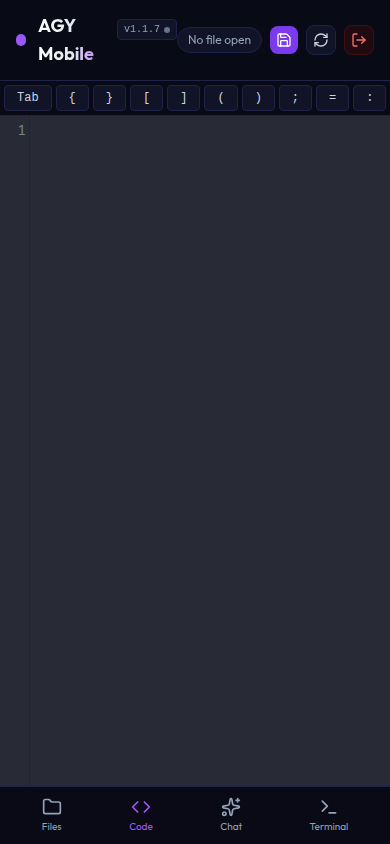
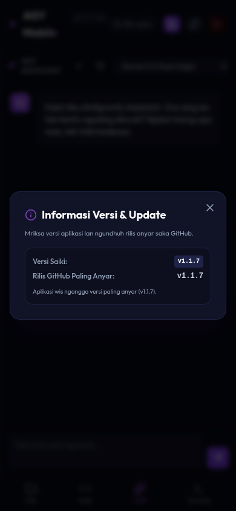
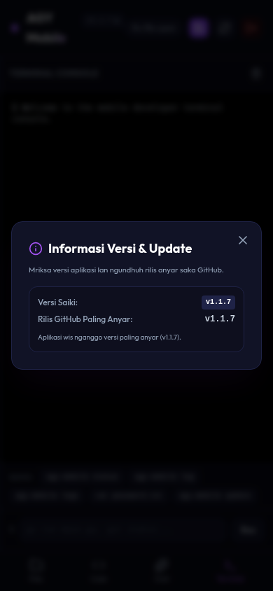
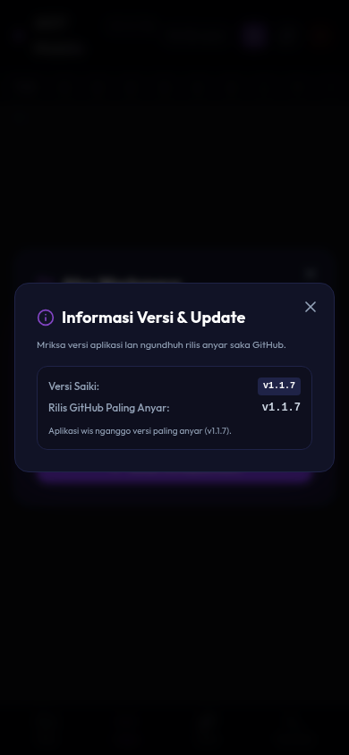
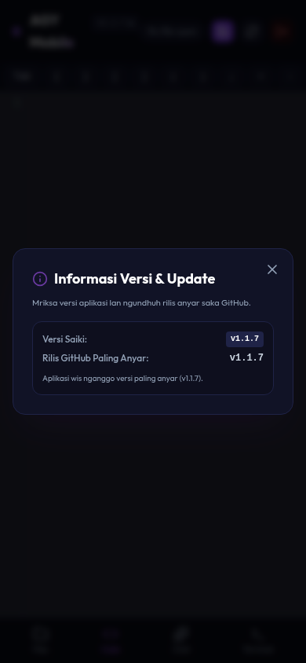

# Antigravity Mobile IDE & Assistant

Aplikasi **Mobile IDE** sing enteng lan modern kanggo ngoding liwat HP Android nggunakake teknologi **Antigravity AI**.

## 📱 Tampilan Mobile (Screenshots)

Berikut adalah galeri tampilan antarmuka Mobile IDE pada perangkat seluler (HP Android/iOS):

| 🔑 Halaman Login | 💻 Code Editor | 💬 Chat Assistant (v1.1.7) |
| :---: | :---: | :---: |
|  |  |  |

| 🐚 Terminal Console | 📁 Atur Workspace | 🔄 Versi & Update (v1.1.7) |
| :---: | :---: | :---: |
|  |  |  |

---

## Fitur Utama
- **Touch-Friendly File Explorer**: Menu file lan folder sing gampang di-swipe lan di-klik ing layar HP.
- **Mobile Code Editor**: Nggunakake CodeMirror kanthi tema Dracula lan dhukungan syntax highlighting (Go, Python, JS, HTML, CSS).
- **Mobile Keyboard Shortcut Helper**: Tombol cepet ing ndhuwur keyboard HP kanggo ngetik karakter pemrograman (`{`, `}`, `[`, `]`, `;`, `=`, lan sakpiturute).
- **Interactive Chat Assistant**: Chatting real-time karo Antigravity AI, lengkap karo fitur **Copy** lan **Insert** kode menyang editor kanthi sekali klik.
- **Terminal Runner**: Nglakokake perintah terminal bash langsung saka HP.
- **REST API ready**: Kabeh fitur bisa diakses nganggo command `curl` liwat Termux/Terminal.

---

## Persyaratan Sistem
- **Go (Golang)**: Versi 1.16 utawa luwih anyar (kudu ana mung yen njenengan kepengin ngompilasi dhewe saka source code).
- **Antigravity CLI (`agy`)**: Wis terinstal lan terotentikasi ing server.
- **Bash, PowerShell, utawa CMD**: Kanggo nglakokake perintah ing terminal console (ing Windows bakal otomatis nggunakake PowerShell utawa CMD yen Bash ora ditemokake).

> [!NOTE]
> **Kompatibilitas GLIBC**:
> Binary pra-kompilasi sing kasedhiya ing GitHub dibangun kanthi **statis (`CGO_ENABLED=0`)**. Iki tegese program ora gumantung marang versi GLIBC sistem (`libc.so`), saengga bisa mlaku kanthi lancar ing distro Linux lawas, lingkungan wadhah (*container*) kaya GitHub Codespaces/Gitpod, sarta Termux ing Android tanpa nemoni masalah error `GLIBC_2.34 not found`.

---

## Cara Instalasi & Kompilasi

### Cara Cepat (One-Line Installer - Tanpa Perlu Install Go/Compiler):
Cukup jalankan perintah iki ing terminal server utawa Termux HP kanggo ngundhuh pre-compiled binary lan nyiapake kabeh kanthi otomatis:
```bash
curl -fsSL https://raw.githubusercontent.com/sodikinnaa/go-agy-ide/main/install.sh | bash
```
*Script iki bakal otomatis ndeteksi OS lan arsitektur CPU (Linux AMD64, Linux ARM64, MacOS, lsp.) sarta ngundhuh binary sing cocog saka kaca Rilis GitHub.*

Yen pengin install versi/tag tartamtu sing wis dirilis, undhuh installer dhisik banjur lebokake tag-e:
```bash
curl -fsSL https://raw.githubusercontent.com/sodikinnaa/go-agy-ide/main/install.sh -o install.sh
bash install.sh v1.3.9
```
Utawa nganggo environment variable:
```bash
curl -fsSL https://raw.githubusercontent.com/sodikinnaa/go-agy-ide/main/install.sh -o install.sh
VERSION=v1.3.5 bash install.sh
```
Iki iso kanggo update menyang versi testing utawa downgrade menyang rilis lawas.

### Cara Manual (Ngompilasi Dewe):
1. **Download source code** lan mlebu menyang folder:
   ```bash
   git clone https://github.com/sodikinnaa/go-agy-ide.git mobile-ide
   cd mobile-ide
   ```

2. **Kompilasi kode program** (kudu ana compiler Go):
   ```bash
   go build -o mobile-agy main.go
   ```

3. **Jalankan server**:
   Njenengan bisa ngeset sandi keamanan liwat environment variable `PASSWORD`. Yen ora diset, server bakal nggawe sandi acak lan nampilake ing log server, sarta disimpen ing file `password.txt`.
   ```bash
   PASSWORD=sandi_njenengan PORT=8080 ./mobile-agy
   ```
   *Secara default, server bakal mlaku ing port `8080` lan ngrungokake kabeh antarmuka jaringan (`0.0.0.0:8080`).*

### 🏁 Panduan Lengkap kanggo Pangguna Windows

Yen njenengan nggunakake Windows, iki tutorial langkah-demi-langkah sing luwih lengkap kanggo nginstal lan nglakokake Mobile IDE tanpa kudu nginstal compiler Go.

#### Langkah 1: Instal Google Antigravity CLI (`agy`)
Mobile IDE butuh tool CLI `agy` kanggo proses chat lan otentikasi.
* **Nggunakake Git Bash / WSL**:
  Jalankan perintah iki ing Git Bash:
  ```bash
  curl -fsSL https://antigravity.google/cli/install.sh | bash
  ```
* **Nggunakake PowerShell / CMD (Manual)**:
  1. Undhuh file binary `agy.exe` kanggo Windows saka situs resmi Antigravity.
  2. Simpen file `agy.exe` ing folder contone `C:\Users\Username\.local\bin` utawa folder liyane.
  3. Lebokake path folder kasebut menyang **Environment Variables (PATH)** Windows supaya bisa diakses saka ngendi wae.

#### Langkah 2: Undhuh Mobile IDE Binary (`mobile-agy.exe`)
Bukak PowerShell utawa Command Prompt (CMD), banjur nggawe folder anyar lan undhuh binary-ne:
* **PowerShell**:
  ```powershell
  mkdir mobile-ide; cd mobile-ide
  curl.exe -L "https://github.com/sodikinnaa/go-agy-ide/releases/latest/download/mobile-agy-windows-amd64.exe" -o mobile-agy.exe
  ```
* **Command Prompt (CMD)**:
  ```cmd
  mkdir mobile-ide && cd mobile-ide
  curl.exe -L "https://github.com/sodikinnaa/go-agy-ide/releases/latest/download/mobile-agy-windows-amd64.exe" -o mobile-agy.exe
  ```

*Cathetan: Yen njenengan kepengin ngompilasi dhewe saka source code (kudu wis nginstal Go), jalankan perintah iki ing terminal:*
```cmd
go build -o mobile-agy.exe main.go
```

#### Langkah 3: Nglakokake Server
Njenengan kudu ngeset sandi keamanan lan port sadurunge nglakokake server:
* **PowerShell**:
  ```powershell
  $env:PASSWORD="sandi_njenengan"
  $env:PORT="8080"
  .\mobile-agy.exe
  ```
* **Command Prompt (CMD)**:
  ```cmd
  set PASSWORD=sandi_njenengan
  set PORT=8080
  mobile-agy.exe
  ```
* **Git Bash / WSL**:
  ```bash
  PASSWORD=sandi_njenengan PORT=8080 ./mobile-agy.exe
  ```
*Secara default, server bakal mlaku ing port `8080` lan ngrungokake kabeh antarmuka jaringan (`0.0.0.0:8080`).*

#### Langkah 4: Mbukak Akses Firewall Windows (Penting!)
Supaya HP Android/iOS bisa ngakses server Mobile IDE sing mlaku ing laptop Windows, njenengan kudu ngizini port kasebut liwat Windows Defender Firewall.

Jalankan perintah iki ing **PowerShell minangka Administrator (Run as Administrator)**:
```powershell
New-NetFirewallRule -DisplayName "Antigravity Mobile IDE" -Direction Inbound -LocalPort 8080 -Protocol TCP -Action Allow
```
*(Yen njenengan nggunakake port liyane saliyane `8080`, ganti nilai `-LocalPort` cocog karo port sing diset).*

#### Langkah 5: Nyambungake HP Android/iOS
1. Priksa manawa HP lan laptop Windows nyambung ing **siji jaringan Wi-Fi sing padha**.
2. Goleki IP lokal laptop Windows:
   * Bukak CMD, ketik `ipconfig`.
   * Goleki bagean Wi-Fi utawa Ethernet, banjur cathet **IPv4 Address** (contone: `192.168.1.15`).
3. Bukak browser (Chrome, lsp.) ing HP, banjur ketik alamat kasebut karo port-e:
   ```text
   http://192.168.1.15:8080
   ```
4. Lebokake sandi keamanan sing wis njenengan set ing Langkah 3 (`sandi_njenengan`).

---

## Provider AI OpenAI-Compatible (Opsional)

Mobile IDE tetep njaga integrasi resmi **Antigravity CLI (`agy`)** minangka default. Yen pengin nambah sumber AI liyane, sampeyan bisa nyetel provider **OpenAI-compatible** kayata OpenAI, DeepSeek, OpenRouter, LM Studio, utawa Ollama tanpa mbusak `agy`.

### Konfigurasi saka UI
Sawise login sandi, bukak halaman utama banjur klik tombol **gear/settings** ing panel chat. Saka kono sampeyan bisa:
- ngisi utawa ngganti **API key**,
- ngisi **endpoint base URL**,
- klik **Fetch models dari key** kanggo njupuk daftar model saka endpoint `/models`,
- nyimpen daftar model supaya muncul ing dropdown chat.

API key ora dibalikke mentah menyang browser; UI mung nampilake status lan key sing di-mask.

### Konfigurasi nganggo file `.env`
Gawe file `.env` ing folder sing padha karo `mobile-agy.exe`:
```env
PASSWORD=sandi_njenengan
PORT=8080
OPENAI_API_KEY=sk-isi_api_key_kene
OPENAI_API_BASE=https://api.openai.com/v1
OPENAI_MODELS=gpt-4o,gpt-4o-mini,deepseek-chat
```

Cathetan:
- `OPENAI_API_BASE` default-e `https://api.openai.com/v1` yen ora diset.
- `OPENAI_MODELS` dipisah koma. Model iki bakal muncul ing daftar model kanthi prefix `openai/`, contone `openai/gpt-4o`.
- Kanggo Ollama lokal, biasane nganggo `OPENAI_API_BASE=http://localhost:11434/v1` lan `OPENAI_API_KEY=ollama`.
- Model resmi saka `agy` tetep kasedhiya; model eksternal mung ditambahake minangka pilihan ekstra.

### Contoh PowerShell tanpa file `.env`
```powershell
$env:PASSWORD="sandi_njenengan"
$env:OPENAI_API_KEY="sk-isi_api_key_kene"
$env:OPENAI_API_BASE="https://api.openai.com/v1"
$env:OPENAI_MODELS="gpt-4o,gpt-4o-mini"
.\mobile-agy.exe
```

### Endpoint konfigurasi via curl
```bash
curl -X POST http://localhost:8080/api/openai/settings \
  -H "Content-Type: application/json" \
  -d '{"apiKey":"sk-isi_api_key_kene","apiBase":"https://api.openai.com/v1","models":"gpt-4o,gpt-4o-mini"}'
```

Njupuk daftar model saka key/endpoint sing wis disimpan:
```bash
curl -s http://localhost:8080/api/openai/models
```

### Contoh chat via curl
```bash
curl -N -d "prompt=Tuliskan fungsi Go kanggo validasi email" -d "model=openai/gpt-4o-mini" http://localhost:8080/api/chat
```

---

## Perintah Global `agy-mobile`

Sawise instalasi, njenengan bisa nggunakake perintah global `agy-mobile` saka ngendi wae ing terminal:

* **Mriksa status server (running/stopped, port, sandi)**:
  ```bash
  agy-mobile status
  ```
* **Miwiti server**:
  ```bash
  agy-mobile start
  ```
* **Mandhegake server**:
  ```bash
  agy-mobile stop
  ```
* **Miwiti maneh (restart) server**:
  ```bash
  agy-mobile restart
  ```
* **Maca log server (100 baris pungkasan)**:
  ```bash
  agy-mobile log
  ```
  *Bisa uga nggunakake `agy-mobile log -f` kanggo streaming log sacara real-time.*
* **Maca log khusus otentikasi/login Google**:
  ```bash
  agy-mobile logs
  ```
  *Nampilake mung baris log sing ngemot informasi otentikasi Google.*
* **Nganyari (update) server menyang versi paling anyar**:
  ```bash
  agy-mobile update
  ```
* **Nampilake daftar rilis/tag sing kasedhiya**:
  ```bash
  agy-mobile releases
  ```
* **Nganyari utawa downgrade menyang versi tartamtu**:
  ```bash
  agy-mobile update v1.3.9
  agy-mobile install-version v1.3.5
  ```
* **Mbusak instalasi (uninstall) Mobile IDE**:
  ```bash
  agy-mobile uninstall
  ```

---

## Cara Update Mobile IDE (Manual)

Yen ana versi anyar utawa update, saliyane nganggo `agy-mobile update`, njenengan uga bisa mlebu menyang folder `mobile-ide` banjur nglakokake perintah iki:
```bash
./update.sh
```
Kanggo target versi spesifik:
```bash
./update.sh v1.3.9
./update.sh v1.3.5
```
*Script iki bakal otomatis ngundhuh installer paling anyar saka GitHub, nganyari binary program, lan miwiti maneh server **tanpa ngowahi port, sandi akses, utawa setelan OpenAI-compatible** sing wis disimpen ing file `.env`.*

---

## Cara Akses saka HP Android

Njenengan bisa ngakses Mobile IDE iki saka HP Android nganggo rong cara:

### Cara 1: SSH Port Forwarding (Paling Aman)
Cara iki disaranake lan bisa digunakake ing Linux utawa Windows:
1. Bukak **Termux** utawa **Termius** ing HP Android.
2. Koneksi menyang laptop/server nggunakake perintah port forwarding iki:
   ```bash
   ssh -L 8080:localhost:8080 username@ip-laptop-utawa-server
   ```
3. Sawise kasil konek, bukak **browser (Chrome/liyane)** ing HP, banjur bukak alamat:
   ```text
   http://localhost:8080
   ```
4. Lebokake sandi keamanan sing wis diset utawa sing ana ing `password.txt`.

### Cara 2: Akses Langsung Jaringan Wi-Fi (Khusus Windows/Linux ing siji Wi-Fi)
Yen HP lan Laptop njenengan nyambung ing siji jaringan Wi-Fi sing padha:
1. **Goleki IP lokal laptop**:
   * **Windows**: Bukak Command Prompt (CMD), ketik `ipconfig`, goleki `IPv4 Address` (contone: `192.168.1.15`).
   * **Linux**: Bukak Terminal, ketik `hostname -I` utawa `ip a`.
2. **Atur Firewall Windows** (yen perlu): Make sure port `8080` (utawa port custom sing dipilih) diizini liwat Windows Defender Firewall.
3. Bukak **browser** ing HP Android, banjur bukak alamat IP lokal laptop kasebut langsung:
   ```text
   http://192.168.1.15:8080
   ```
4. Mlebokake sandi keamanan kanggo ngakses editor.

---

## Dokumentasi API (Akses liwat `curl`)

Amarga saiki server langsung mriksa otentikasi Google Antigravity (`agy`) ing mesin, njenengan ora butuh cookie utawa sandi tambahan kanggo `curl`. Angger server wis login menyang Google, kabeh perintah `curl` ing ngisor iki iso langsung dijalankan saka HP Android (Termux) utawa terminal laptop.

> [!IMPORTANT]
> **Cathetan kanggo pangguna Windows PowerShell**:
> Ing PowerShell, perintah `curl` minangka alias saka `Invoke-WebRequest` sing duwe alur beda lan ora ndhukung streaming.
> Supaya lancar ing PowerShell, ganti perintah `curl` dadi **`curl.exe`** (contone: `curl.exe -N -d "prompt=..." http://localhost:8080/api/chat`).


* **Obrolan/Chat karo Antigravity (Streaming)**:
  ```bash
  curl -N -d "prompt=Buatkan endpoint HTTP GET baru" http://localhost:8080/api/chat
  ```

* **Nglakokake Perintah Terminal (Streaming)**:
  ```bash
  curl -N -d "command=go test ./..." http://localhost:8080/api/run
  ```

* **Maca Daftar File ing Workspace**:
  ```bash
  curl -s http://localhost:8080/api/files
  ```

* **Maca Isi File**:
  ```bash
  curl -s "http://localhost:8080/api/file?path=main.go"
  ```

* **Nyimpen / Nulis File**:
  ```bash
  curl -X POST -d "isi_kode_baru_di_sini" "http://localhost:8080/api/file?path=nama_file.go"
  ```

* **Mbusak File utawa Folder**:
  ```bash
  curl -X DELETE "http://localhost:8080/api/file?path=nama_file.go"
  ```

* **Maca Daftar Workspace (Recent & Active)**:
  ```bash
  curl -s http://localhost:8080/api/workspaces
  ```

* **Ngalih / Milih Workspace Aktif**:
  ```bash
  curl -d "path=/home/sodikinnaa/sodikin/project-lain" http://localhost:8080/api/workspaces/select
  ```

* **Nambah & Bukak Workspace Anyar**:
  ```bash
  curl -d "path=/home/sodikinnaa/sodikin/project-anyar" http://localhost:8080/api/workspaces/add
  ```


